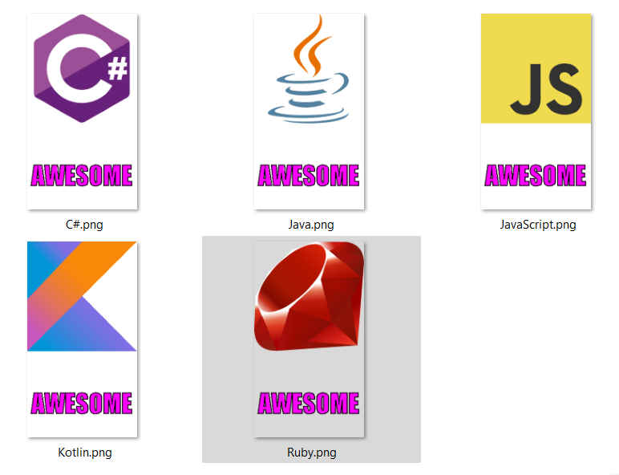
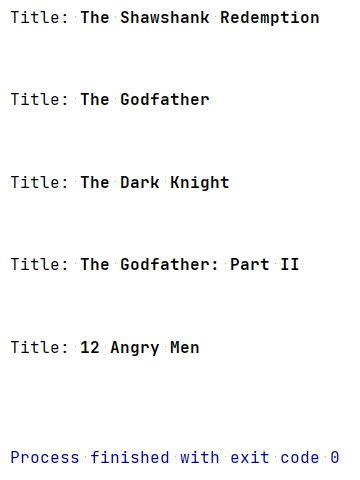

# Sticker Generator (Alura exercise)

A project intended for generating messenger-style stickers from various API JSON sources. The program creates an HTTP connection to an API in order to download images and saves them locally after drawing custom text on them:

This was an exercise for learning how to code, part of the **Imersão JAVA** mini-course from Alura (2023 edition).

**KNOWN ISSUES:** When dealing with different API sources, the program may not generate stickers with proper bottom text since different image sizes may result in text not displaying properly, hence the need for constant adjustments in the code.
